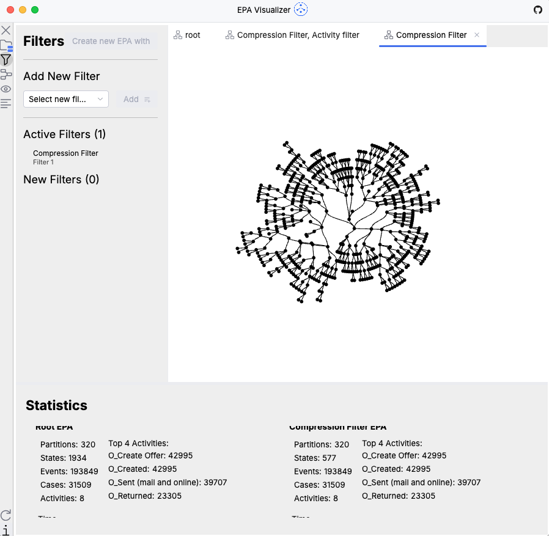

# EPA Visualizer: Compact visualization of prefix trees

🎓 _Master's thesis — Moritz Lindner @ [Humboldt-Universität zu Berlin](https://www.hu-berlin.de/)_ in the area of
Process Mining

[](https://github.com/linde9821/epa-visualizer/actions/workflows/gradle.yml)

## 🔍 Overview

**EPA Visualizer** constructs and visualizes an **Extended Prefix Automaton (EPA)** from
raw [XES event logs](https://www.tf-pm.org/resources/xes-standard/about-xes/event-logs).



An EPA is a prefix automaton extended with partitions, where each partition represents a distinct *variant* (unique
execution trace) observed in the event log.

EPAs provide a complete, non-abstracted representation of all observed process behavior — preserving full trace
information while capturing shared prefixes in a compact graphical form.  
This enables interactive and animated visualization of process behavior and variation, with a primary focus on exploring
variants within the process.

The tool helps users understand process complexity and behavior through:

- variant-based views of the process
- showing details for all states present in an EPA
  Structural insights into common prefixes and branching points, as well as multiple options for hierarchical and
  semantic layouts
- flexible filtering options to explore and manage large and complex EPA
- statistics and animations of events flowing through an EPA

The tool supports event logs in `.xes` and `.xes.gz` formats.

Currently only some event-logs are supported (due to the requirement of a mapper for trace id, activity):

- [BPI Challenge 2017 - Offer log](https://data.4tu.nl/articles/dataset/BPI_Challenge_2017_-_Offer_log/12705737)
- [BPI Challenge 2017](https://data.4tu.nl/articles/dataset/BPI_Challenge_2017/12696884)
- [BPI Challenge 2018](https://data.4tu.nl/articles/dataset/BPI_Challenge_2018/12688355)
- [Sepsis Cases - Event Log](https://data.4tu.nl/articles/dataset/Sepsis_Cases_-_Event_Log/12707639)
- some sample logs

All logs are available under [data/eventlogs/*](./data/eventlogs)

---

## ✨ Features

- **Event Log Import**:
    - Supports `.xes` and `.xes.gz` formats
- **EPA Construction**:
    - Automatic generation of an Extended Prefix Automaton from event logs
- **Visualization**:
    - Multiple graph layout algorithms
        - semantic layouts
        - hierarchical layouts
        - Clustering / Similarity based Layouts
    - Zoom, scroll, and interactive navigation
    - Animated playback of complete logs or individual cases
- **Statistics**:
    - Events per node
    - Case counts
    - Activity frequencies
    - Time intervals
    - Partition-based statistics
- **Filters**:
    - Activity based
    - State Frequency
    - Partition Frequency
    - Chain Compression
- **State Details**:
    - Details for each state:
        - Transitions
        - Path from root
        - Traces at state
        - Cumulative Events
        - Cycle Time Histogram

### Potential Improvements

- Pre-render the tree layout to a texture and render the texture instead of the entire tree on every frame  
  _(similar to how labels are currently rendered in the tree); rerender only when necessary (e.g., after filtering)_

- Core data structures in EPA construction are optimized, but some data structures and algorithms in
  animation/statistics and others are not optimal — can be improved for better performance

---

## 🗂️ Project Structure

The project consists of two modules:

1. **`epa`** — core logic for EPA construction, layout generation, visitors for automation, statistics, etc.
2. **`ui`** — desktop application (Kotlin Compose Desktop), built on top of the `epa` module.

---

## 🚀 Getting Started

### Prerequisites

- JetBrains Runtime **25+** (it must be a jetbrains JDK due to the usage
  of [jewels](https://github.com/JetBrains/intellij-community/tree/master/platform/jewel))
- Kotlin **2.2.21+**
- Gradle (or use the included Gradle wrapper)

### Run the App

> **_NOTE:_**  The application requires a [JetbrainsRuntime](https://github.com/JetBrains/JetBrainsRuntime) to run.
> It Should be downloaded automatically when running Gradle command through Foojay.

```shell
./gradlew run
```

### Custom `EventLogMapper`

To support additional event logs, you can implement a custom EventLogMapper and plug it into the application.
Out-of-the-box, the project provides mappers for event logs included in [data/eventlogs/*](./data/eventlogs).

### Writing code

The project is designed for easy extension.
In most cases, using the `AutomatonVisitor` interface is sufficient for adding new functionality — it provides complete
and correct traversal (depth-first or breadth-first) of the EPA.
Core features such as filtering, animation, and statistics are already implemented using this pattern — making it a
natural extension point for new features or experiments.

## 🖥️ Technologies

- **Kotlin** Gradle project
- **Kotlin Compose Desktop**
- **OpenXES**
- **Jewels**

---

## 📚 Background

This software is part of a university Master's thesis exploring new visualization techniques for process mining.

Based on concepts from (but not limited to):

- Augusto, Mendling, Vidgof, & Wurm (2022) – The connection between process complexity of event sequences and models
  discovered by process mining
- Visualization: Radial tidy tree with optimizations from Buchheim et al. (2002)
- TODO: add further main refrences

## 🙋‍♂️ Author

Moritz Lindner
Senior DevOps Engineer & computer science M.Sc. Student
Berlin, Germany
